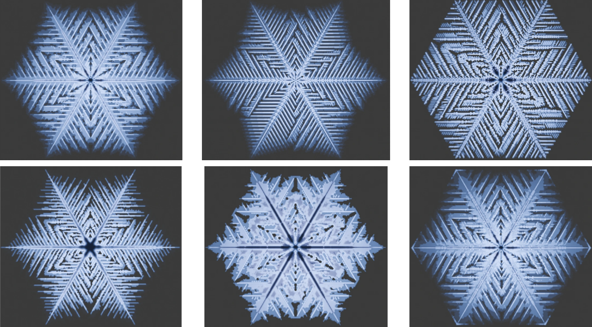
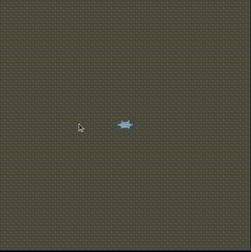

# Frost-Sim — GPU-Accelerated Ice Crystal Growth Simulators

A collection of four ice crystal growth simulators written in C++ and OpenGL, exploring different physical models for dendritic snowflake formation: from discrete cellular automata to continuous phase-field equations. The primary cellular automata simulator runs entirely on the GPU via GLSL compute shaders. This project was chosen due to dissatisfaction I've had with existing snowflake/frost generation algorithms.

---



---

## Overview

Snowflakes grow through vapor deposition, water vapor in supersaturated air deposits directly onto an ice crystal, building intricate branching structures. The exact morphology (plates, dendrites, needles, ferns) depends on temperature, supersaturation, and surface kinetics. Modeling this process accurately requires balancing diffusion, attachment physics, and anisotropy.

This project implements four different approaches to simulating this phenomenon, each making different tradeoffs between physical fidelity, computational cost, and the kinds of morphologies they can produce.

---

## Simulators

### 1. CA-Frost: Hexagonal Cellular Automaton (GPU)

The primary simulator. Models crystal growth on a 3D hexagonal lattice using a discrete cellular automaton where each site holds diffusive mass (vapor), boundary mass, and attached mass (crystal). Growth rules are controlled by lookup tables indexed by neighbor configuration, allowing fine-grained control over branching behavior.

All six physics kernels (planar diffusion, basal diffusion, boundary detection, freezing, attachment, melting) run as GLSL 430 compute shaders with no CPU-side particle loops. The hexagonal grid naturally produces six-fold symmetric crystals without needing anisotropy terms in the equations. Neighbor-dependent kappa/beta tables give direct, interpretable control over which growth conditions produce plates vs. dendrites vs. ferns.

```
Grid:       Hexagonal lattice (axial coordinates), ~30,000 sites
Vertical:   ~400 basal layers (2.5D)
Parameters: ρ (supersaturation), κ[2×4] (freezing rates), β[2×4] (attachment thresholds)
```



---

### 2. Kobayashi Phase-Field

The classic/original reaction-diffusion phase-field model based on Kobayashi et al. (1996). Solves coupled PDEs for a phase field and temperature field, where crystal growth is driven by undercooling and shaped by anisotropic surface energy.

The most physically grounded model. Growth emerges from the equations themselves rather than from hand-tuned rules. The interface thickness, relaxation timescale, and anisotropy strength are all derived from physical parameters. Produces the smoothest, most organic-looking crystal shapes, but is the most computationally expensive and gives you the least direct control over specific morphologies.

```
Grid:       200×200 rectangular cells
Fields:     Phase (φ), temperature (T)
Parameters: ε̄ (interface thickness), τ (relaxation), K (reaction), δ (anisotropy)
```


---

### 3. Vapor-Field: 3D Phase-Field with Vapor Layers

Extends the phase-field approach into 3D by stacking 30 vapor diffusion layers above a substrate crystal at z=0. Uses hexagonal finite-difference operators for gradient computation, combining the hexagonal geometry of the CA model with the continuous physics of the phase-field approach.

The only simulator that models the full 3D vapor field above the crystal surface. Where the other models treat the vapor as a 2D concentration field in the plane of the crystal, this one resolves how vapor depletes vertically above growing tips — a key physical effect that determines whether branches starve their neighbors of material. The hexagonal gradient operators give it natural six-fold symmetry without artificial anisotropy.

```
Grid:       200×200 hexagonal (odd-r offset) × 30 vertical layers
Fields:     Phase (φ), vapor_u[30] (3D vapor concentration)
Parameters: ε̄, δ (anisotropy), τ, λ (supersaturation)
```

---

1. 4. Hybrid-Frost: Continuous-Discrete Hybrid

Combines a continuous phase field with discrete attachment rules on a rectangular grid. Uses Allen-Cahn smoothing for interface regularization and adds hexagonal anisotropy through angle-dependent penalty terms.

**MY MAIN CONTRIBUTION!** Sits between the purely discrete CA model and the purely continuous phase-field models. The continuous diffusion field produces smoother interfaces than the CA, while the discrete attachment rules preserve the sharp growth/no-growth decisions that give crystals their faceted edges.

```
Grid:       250×250 rectangular cells
Fields:     Phase (φ), diffusive mass (d), boundary mass (b)
Parameters: ρ, κ_eff, β_convex/concave, δ_β_hex (anisotropy), D_diff
```


---

## How They Compare

|                             | CA-Frost                             | Hybrid-Frost                         | Kobayashi           | Vapor-Field            |
| --------------------------- | ------------------------------------ | ------------------------------------ | ------------------- | ---------------------- |
| **Grid**              | Hexagonal 3D                         | Rectangular 2D                       | Rectangular 2D      | Hexagonal 3D           |
| **Physics**           | Discrete rules                       | Hybrid                               | Continuum PDE       | Continuum PDE          |
| **GPU accelerated**   | Yes (compute shaders)                | No                                   | No                  | No                     |
| **Anisotropy source** | Hex grid geometry                    | Angle-dependent penalty              | Surface energy term | Hex gradient operators |
| **Best for**          | Fast exploration, morphology control | Asymmetric growth, smooth interfaces | Physical accuracy   | Vertical vapor effects |

---

## What I'm Working On

- Improving the **hybrid-frost** parameter interface to recreate large scale (meters) frost growth while maintaining fine-grained detail.
- Exploring whether the **vapor-field** model can reproduce morphologies that the 2D models miss. Not much luck with this so far.

---

## Project Structure

```
frost-sim/
├── simulators/
│   ├── ca-frost/              # GPU cellular automaton (primary simulator)
│   │   ├── sim/               # C++ source (FROST.h/cpp, main.cpp)
│   │   ├── compute/           # GLSL 430 compute shaders (6 kernels)
│   │   ├── render/            # GLSL 430 vertex/fragment shaders
│   │   └── util/              # Shader utilities, PPM export
│   ├── hybrid-frost/          # Hybrid continuous-discrete model
│   ├── kobayashi-phase-field/ # Classical phase-field (Kobayashi equations)
│   └── vapor-field/           # 3D vapor diffusion + phase-field
├── analysis/                  # ML morphology classification pipeline
│   ├── run_classifier.py      # Snowflake pattern classifier
│   ├── run_lda.py             # Linear discriminant analysis
│   ├── run_tsne.py            # t-SNE visualization
│   └── labeled_dataset.csv    # Training data (~1000 labeled morphologies)
├── media/                     # Output images
├── bin/                       # Compiled binaries
├── Makefile.linux             # Build for CA-Frost
└── run_ca.sh, render_ca.sh    # Build & run scripts
```

---

## Controls (CA-Frost)

| Input          | Action                                  |
| -------------- | --------------------------------------- |
| `Space`      | Pause / resume simulation               |
| `S`          | Toggle site visualization               |
| `E`          | Toggle hex edge rendering               |
| `B`          | Toggle boundary cell visibility         |
| `Z` / `X`  | Zoom in / out                           |
| `Arrow keys` | Pan / rotate camera                     |
| `H`          | Export height map and density map (PPM) |
| `Q`          | Quit                                    |

---

## Dependencies

| Library         | Purpose                       |
| --------------- | ----------------------------- |
| OpenGL 4.3+     | Compute shaders, SSBO support |
| GLEW            | OpenGL extension loading      |
| GLUT / freeglut | Window and input management   |
| GLM             | Matrix and vector math        |

For the analysis pipeline: Python 3 with NumPy, scikit-learn, matplotlib, pandas.

### Install (Ubuntu/Debian)

```bash
sudo apt install libglew-dev libglfw3-dev libglm-dev
```

Verify OpenGL version:

```bash
glxinfo | grep "OpenGL version"
```

---

## Building & Running

```bash
# Build CA-Frost (primary simulator)
make -f Makefile.linux

# Run
./bin/frost

# Run with custom parameters
./bin/frost 0.16 "0.03 0.025 0.75 0.90" "0.06 0.79 0.03 0.14" \
  "2.54 2.61 2.57 5.22" "0.55 2.93 2.27 1.10"
```

Each simulator in `simulators/` has its own Makefile for independent builds. Note: the CA-frost simulators build settings are in the project root, not it's src folder.

---

## References

- Gravner, J., & Griffeath, D. (2008). *Modeling snow crystal growth: A three-dimensional mesoscopic approach.* Physical Review E, 79(1).
- Kobayashi, R. (1993). *Modeling and numerical simulations of dendritic crystal growth.* Physica D, 63(3–4), 410–423.
- Libbrecht, K. G. (2005). *The physics of snow crystals.* Reports on Progress in Physics, 68(4), 855–895.

---
